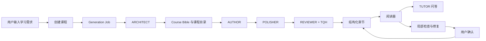

# LearnByAI

LearnByAI 是一个面向个性化学习的 AI 课程生成、教材阅读与智能辅导平台。

用户只需要描述想学习的主题、学习目标、已有基础、偏好的教学方式和每周可投入时间，系统就会自动规划课程结构，生成 Course Bible、章节目录和教材正文，并在阅读过程中提供基于具体段落的 AI 导师问答与教材局部修复能力。

项目目前已经从早期的浏览器本地 MVP 演进为支持 Supabase、后台任务、用户隔离、配额、导出、质量检查和管理后台的全栈 Beta 系统。

## 核心目标

LearnByAI 试图解决普通 AI 问答在学习场景中的几个问题：

- 普通对话缺少完整课程结构，知识点容易零散。
- 长篇 AI 教材容易出现章节间不连贯、术语不一致和难度漂移。
- Markdown、LaTeX 和代码块可能出现格式错误。
- 通用回答难以适配不同学习者的基础和目标。
- 教材生成后缺少持续问答、纠错和局部修复机制。

LearnByAI 使用 Course Bible、多 Agent 生成流水线、章节质量检查和锚定式 Tutor，将一次性的文本生成转变为可规划、可阅读、可追问、可检查和可修复的学习材料。

## 主要功能

### 1. 个性化课程创建

创建课程时，用户可以提供：

- 学习主题
- 学习目标
- 已有知识背景
- 偏好的教学风格
- 每周学习时间
- 章节长度偏好

系统会先创建课程壳和后台任务，再由 `ARCHITECT` Agent 生成：

- 学习者画像
- Course Bible
- 全局教学叙事
- 课程章节目录
- 章节依赖关系
- 术语表
- 每章的教学契约和目标

### 2. 多 Agent 教材生成

教材内容并不是通过一个 Prompt 一次性完成，而是由多个角色协作：

| Agent | 职责 |
| --- | --- |
| `ARCHITECT` | 规划 Course Bible、课程结构、知识依赖和章节目标 |
| `AUTHOR` | 根据课程约束撰写章节正文 |
| `POLISHER` | 修复 Markdown、LaTeX、代码块和内容格式 |
| `REVIEWER` | 对章节结构、连续性和教学质量进行复核 |
| `TUTOR` | 根据选中原文、课程背景和对话历史回答问题 |
| `ASSISTANT` | 在部分修复流程中作为默认模型回退角色 |

课程创建后会优先规划完整目录并生成第一章，后续章节按需生成，减少不必要的模型调用和等待时间。

### 3. 教材质量保障

项目中的 TQH（Textbook Quality Harness）负责对生成内容进行检查：

- 章节结构完整性
- Markdown 格式
- LaTeX 数学公式格式
- 代码块和标题格式
- 章节前后连续性
- 必需知识点覆盖情况
- 轻量级事实与过度断言检查
- 自动格式修复
- REVIEWER 二次复核

章节会根据检查结果进入：

- `draft_ready`
- `quality_failed`
- `ready`
- `failed`

质量不达标时，系统会保留当前最佳草稿和问题报告，而不是静默丢失内容。

### 4. 稳定阅读器

阅读器支持：

- Markdown
- GFM 表格与列表
- LaTeX 行内公式和块级公式
- 代码高亮
- 章节目录
- 上一章/下一章导航
- 章节生成状态
- 质量检查结果
- 打印和 PDF 导出
- 深色与浅色主题

### 5. 锚定式 AI Tutor

用户可以在教材中：

- 鼠标选中文字
- 双击段落
- 针对具体公式或内容发起提问
- 继续多轮追问
- 重新打开本章历史讨论

Tutor 不只接收当前问题，还会获得：

- 课程主题和学习目标
- 学习者画像
- 教学风格
- 当前章节标题和目的
- 上一章与下一章
- 当前章节内容摘要
- Course Bible 中的相关术语
- 最近几轮对话历史

阅读器提供以下快捷操作：

- 解释得更简单
- 给出具体例子
- 展示推导过程
- 质疑当前内容
- 检查问题
- 修复这段

### 6. 教材局部修复

当用户发现公式乱码、Markdown 错误、表述不清或明显内容问题时，可以选中对应原文并点击 `检查问题` 或 `修复这段`。

系统会：

1. 检查选中的教材内容。
2. 生成最小范围的修复建议。
3. 展示问题诊断、原文和修复后内容。
4. 等待用户确认。
5. 用户点击 `应用修改` 后，由后端精确替换目标内容。
6. 清除旧质量报告，并将章节标记为需要重新质检。

应用修改时要求原文在目标章节或小节中精确匹配。如果原文已变化或出现多次，后端会拒绝修改，避免误覆盖其他内容。

当前版本首先支持“选中原文后修复”。截图识别和自动 OCR 定位暂未作为默认修改路径。

### 7. 后台任务与实时状态

耗时的课程规划和章节生成通过 `generation_jobs` 管理。

生产环境可以运行独立 Worker：

```bash
npm run worker:loop
```

Worker 支持：

- 队列任务认领
- 任务租约
- 避免重复处理
- 精确任务恢复
- 并发限制
- 失败重试
- 任务事件审计

前端通过 SSE 接收课程和任务状态更新，减少频繁轮询。

### 8. Supabase 持久化与认证

配置 Supabase 后，系统支持：

- Supabase Auth
- 邮箱密码登录
- 用户资料
- 课程和章节持久化
- 结构化小节
- Tutor 批注与对话记录
- 生成任务
- 质量报告
- 使用配额
- 导出记录
- Supabase Storage 私有文件
- Row Level Security

浏览器状态不是权威数据源。刷新或重新进入页面后，课程和讨论记录会从服务器 API 重新读取。

### 9. PDF 与 TeX 导出

课程支持：

- PDF 导出
- TeX 导出
- 独立导出任务记录
- Supabase Storage 私有存储
- 用户隔离下载

PDF 使用支持中文的字体方案，导出接口不会把完整文件内容直接内联在 JSON 响应中。

### 10. 配额与用量记录

系统对以下行为进行每日配额控制：

- 创建课程
- 生成章节
- Tutor 问答
- 导出文件

只有操作成功并完成持久化后才会真正消耗配额。Supabase 模式使用原子配额预留 RPC，避免并发请求绕过限制。

### 11. 管理后台

管理后台入口：

```text
/admin
```

后台提供：

- 系统概览
- 用户管理
- 课程和章节管理
- 生成任务管理
- 质量报告查看
- 导出记录
- 用量统计
- Agent 和模型配置
- 管理操作审计

生产环境必须设置独立的管理员用户名、强密码和 Session Secret。

## 系统架构



## 技术栈

| 分类 | 技术 |
| --- | --- |
| Web 框架 | Next.js App Router |
| 开发语言 | TypeScript |
| 前端 | React 19 |
| UI | Tailwind CSS、Radix UI、shadcn 风格组件 |
| 动画 | Framer Motion |
| Markdown | react-markdown、remark-gfm |
| 数学公式 | remark-math、rehype-katex、KaTeX |
| 代码高亮 | highlight.js |
| 数据库与认证 | Supabase Auth、Supabase Postgres |
| 文件存储 | Supabase Storage |
| AI 接口 | OpenAI-compatible Chat Completions API |
| 数据校验 | Zod |
| E2E 测试 | Playwright |
| 单元测试 | Node Test Runner + TSX |

## 快速开始

### 环境要求

- Node.js 20 或更高版本
- npm
- 可选：Supabase 项目
- 可选：兼容 OpenAI Chat Completions 的 AI API

### 安装依赖

```bash
git clone git@github.com:maomaomaommm/LearnByAI.git
cd LearnByAI
npm install
```

### 配置环境变量

```bash
cp .env.example .env.local
```

最小 AI 配置：

```env
AI_API_KEY=your_api_key
AI_API_BASE_URL=https://api.example.com/v1
AI_MODEL=your_model
AI_MOCK_MODE=false
```

如果不配置 `AI_API_KEY`，本地开发可以使用 Mock 内容体验主要流程。

### 启动开发环境

```bash
npm run dev
```

访问：

```text
http://localhost:3000
```

### 生产构建

```bash
npm run build
npm run start
```

## Supabase 配置

将 [`supabase/schema.sql`](supabase/schema.sql) 应用到 Supabase 数据库，然后配置：

```env
NEXT_PUBLIC_SUPABASE_URL=
NEXT_PUBLIC_SUPABASE_ANON_KEY=
SUPABASE_SERVICE_ROLE_KEY=
SUPABASE_EXPORTS_BUCKET=learnbyai-exports
```

Schema 会创建或配置：

- 用户资料
- 课程
- 章节
- 小节
- Tutor 批注
- 对话消息
- 生成任务
- 质量报告
- 导出记录
- 使用事件
- 配额预留
- 管理设置与审计日志
- Worker 任务认领 RPC
- 配额预留 RPC
- Schema 版本检查函数
- 私有导出 Storage Bucket
- RLS 策略

不要在浏览器代码中暴露 `SUPABASE_SERVICE_ROLE_KEY`。

## 后台 Worker

本地开发默认可以使用内联模式：

```env
GENERATION_WORKER_MODE=inline
```

生产环境建议：

```env
APP_BASE_URL=https://your-domain.example
GENERATION_WORKER_MODE=external
INTERNAL_WORKER_SECRET=至少32字符的随机字符串
GENERATION_WORKER_LIMIT=10
GENERATION_WORKER_REQUEST_TIMEOUT_MS=1200000
```

单次执行：

```bash
npm run worker:once
```

持续执行：

```bash
npm run worker:loop
```

可以使用 systemd、容器、Cron 或外部队列系统管理 Worker。

## 多模型配置

默认模型配置来自：

```env
AI_API_BASE_URL=
AI_API_KEY=
AI_MODEL=
AI_TIMEOUT_MS=
AI_THINKING=
```

每个 Agent 还可以单独覆盖：

```env
ARCHITECT_*
AUTHOR_*
POLISHER_*
REVIEWER_*
TUTOR_*
```

可覆盖的字段包括：

- `API_BASE_URL`
- `API_KEY`
- `MODEL`
- `TEMPERATURE`
- `MAX_TOKENS`
- `TIMEOUT_MS`
- `THINKING`

这允许课程规划、正文生成、格式修复、质量审核和 Tutor 使用不同模型。

## 管理后台配置

```env
LEARNBYAI_ADMIN_USERNAME=
LEARNBYAI_ADMIN_PASSWORD=
LEARNBYAI_ADMIN_SESSION_SECRET=
LEARNBYAI_ADMIN_COOKIE_SECURE=
```

建议：

- 管理员密码使用高强度随机密码。
- Session Secret 至少 32 字符。
- 公网部署使用 HTTPS。
- 不要把真实管理员配置提交到 Git。

## 常用命令

| 命令 | 用途 |
| --- | --- |
| `npm run dev` | 启动开发服务器 |
| `npm run build` | 生产构建 |
| `npm run start` | 启动生产服务器 |
| `npm run lint` | ESLint 检查 |
| `npm run test:unit` | 运行单元测试 |
| `npm run test:schema` | 检查 Supabase Schema |
| `npm run test:e2e` | 运行 Mock 模式 E2E |
| `npm run test:ai-smoke` | 运行真实 AI 冒烟测试 |
| `npm run test:supabase-smoke` | 测试真实 Supabase 项目 |
| `npm run test:beta-ready` | 检查 Beta 环境变量与安全配置 |
| `npm run test:beta-health` | 检查已部署应用健康状态 |
| `npm run test:worker-handoff` | 检查外部 Worker 接管流程 |
| `npm run test:phase-gate` | 运行本地完整阶段检查 |
| `npm run test:beta-gate` | 运行最终 Beta 发布检查 |
| `npm run worker:once` | 执行一次 Worker |
| `npm run worker:loop` | 持续运行 Worker |

## 测试策略

本地阶段检查：

```bash
npm run test:phase-gate
```

该命令依次运行：

1. ESLint
2. 单元测试
3. Schema 检查
4. Next.js 构建
5. Mock AI Playwright E2E

最终 Beta 检查：

```bash
npm run test:beta-gate
```

该流程会进一步检查：

- 严格环境变量
- 真实 Supabase
- RLS 和 RPC 权限
- 部署健康状态
- 外部 Worker 接管
- 真实 AI 课程生成
- Tutor 问答
- PDF/TeX 导出
- 用户隔离
- 配额记录

## 目录结构

```text
LearnByAI/
├── src/app/                 Next.js 页面和 API Routes
│   ├── admin/               管理后台
│   ├── api/                 业务 API
│   ├── courses/             课程和阅读器页面
│   ├── create/              创建课程
│   └── login/               用户登录
├── src/components/          UI 与 Markdown 渲染组件
├── src/lib/
│   ├── maol/                多 Agent 编排
│   ├── prompts/             课程、章节、Tutor 与修复 Prompt
│   ├── quality/             TQH 质量检查
│   ├── supabase/            Supabase 客户端
│   ├── generationWorker.ts  后台任务处理
│   └── serverStore.ts       服务端持久化适配器
├── scripts/                 Worker、测试与发布检查脚本
├── supabase/schema.sql      数据库、RLS、RPC 和 Storage 配置
├── tests/unit/              单元测试
└── tests/e2e/               Playwright E2E
```

## API 概览

课程与章节：

```text
GET  /api/courses
POST /api/courses
GET  /api/courses/[id]
POST /api/chapters/[id]/generate
GET  /api/courses/[id]/events
```

Tutor 与修复：

```text
GET  /api/annotations?chapterId=...
POST /api/annotations
POST /api/repairs
POST /api/repairs/apply
```

任务、导出和用量：

```text
GET  /api/generation-jobs/[id]
POST /api/internal/generation-worker
GET  /api/exports
POST /api/exports
GET  /api/exports/[id]
GET  /api/usage
GET  /api/health/beta
```

## 安全注意事项

- 永远不要提交 `.env.local`。
- 不要把 API Key、Service Role Key、Worker Secret 或管理员密码写入源码。
- 生产环境应使用 HTTPS。
- `INTERNAL_WORKER_SECRET` 应至少 32 字符。
- Supabase anon key 和 service role key 不能相同。
- 导出 Bucket 必须保持私有。
- 用户数据写入应经过 Next.js API，不允许浏览器直接绕过配额和所有权检查。
- 教材修复必须由用户确认后应用，不能让模型静默覆盖正文。

## 当前状态

项目目前处于小用户 Beta 阶段，已经具备：

- 完整课程规划与生成链路
- 多 Agent 协作
- 章节质量检查和自动修复
- Supabase 持久化与用户隔离
- 后台 Worker
- SSE 状态更新
- Tutor 多轮问答
- 教材局部修复
- PDF/TeX 导出
- 配额和用量审计
- 中文管理后台
- 单元测试、E2E 和 Beta 发布检查

后续重点包括：

- Tutor 流式输出
- 截图/OCR 辅助定位教材问题
- 修复建议持久化和版本历史
- 章节修改后的自动重新质检
- 用户长期学习画像
- 基于问答记录动态调整后续课程
- 移动端阅读体验
- 更完整的可观测性与压力测试

## 开发文档

更详细的工程实现、环境约束、测试门禁和 Beta 发布说明见：

[`docs/DEVELOPMENT.md`](docs/DEVELOPMENT.md)

## 许可证

当前仓库尚未声明开源许可证。在添加 LICENSE 之前，请勿默认将代码视为可自由复制、修改或再分发。
